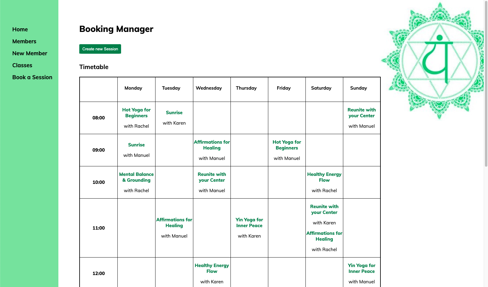
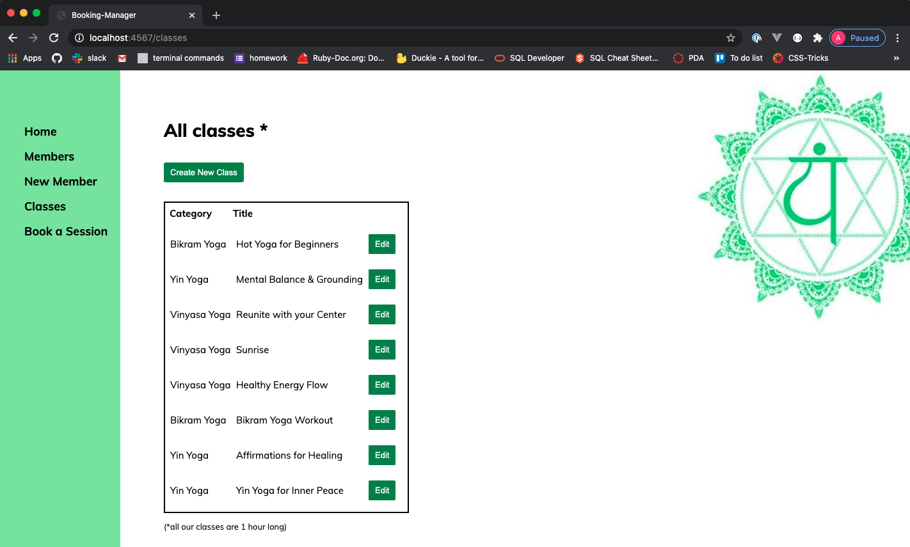

# yoga_studio :lotus_position_woman:
CodeClan Ruby Project

### How to run the application

* Open your terminal and type `drobdb yoga_studio` to drop any Database you might have with the name yoga_studio
* Create a new Database called yoga_studio `createdb yoga_studio`
* Run the following command `psql -d yoga_studio -f db/yoga_studio.sql` to initialize the Database
* At this point the Database is empty, pass in some information by running the seeds.rb file `ruby db/seeds.rb`
* Run `ruby app.rb` to create a server
* In the last line in your terminal you will see the port number for the server
* Open your favourite browser and type the URL localhost: followed by the port number

### The brief 

A local gym has asked you to build a piece of software to help them to manage memberships, and register members for classes.

The user should be able to:

* The app should allow the gym to create and edit Members
* The app should allow the gym to create and edit Classes
* The app should allow the gym to book members on specific classes
* The app should show a list of all upcoming classes
* The app should show all members that are booked in for a particular class

### Extensions

* Classes could have a maximum capacity, and users can only be added while there is space remaining.
* The gym could be able to give its members Premium or Standard membership. Standard members can only be signed up for classes during off-peak hours.
* The Gym could mark members and classes as active/deactivated. Deactivated members/classes will not appear when creating bookings.

### Technologies used

* Ruby
* Sinatra
* SQL

The homepage shows a dynamic timetable once open:

The menu on the left allows the user to visit other sites and use more functionalities such as viewing all yoga classes.

